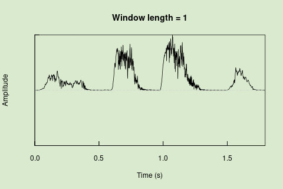
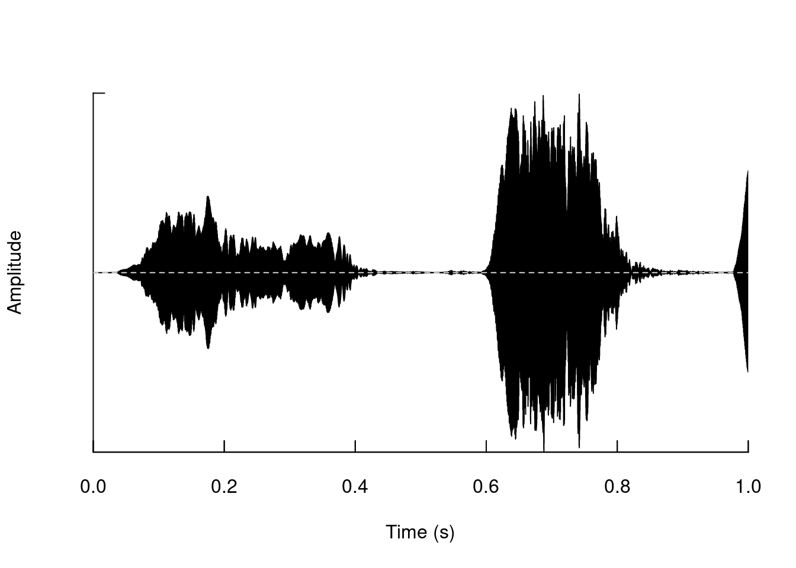
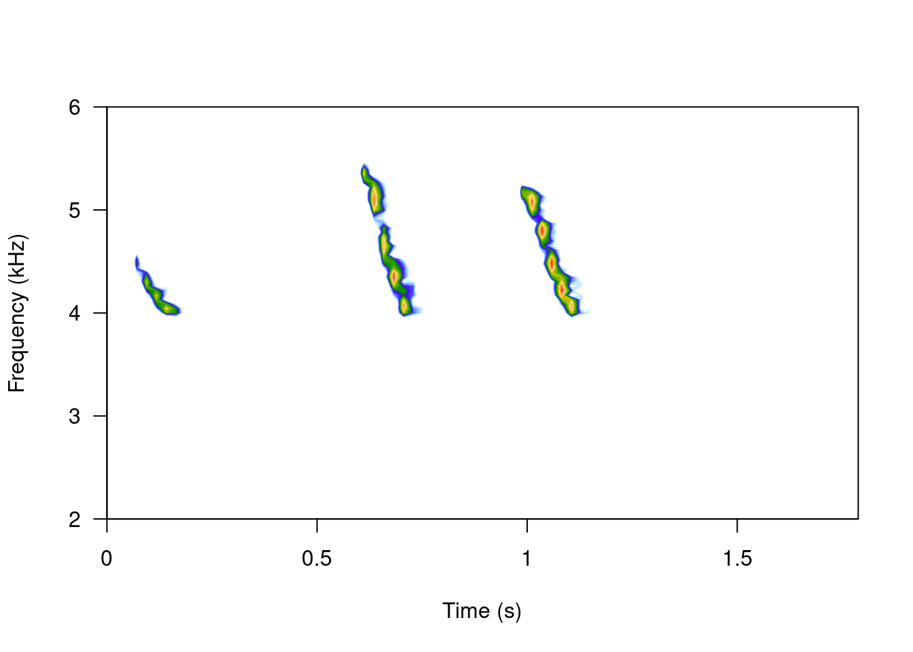

 

::: {.alert .alert-info}
## **Objetives** {.unnumbered .unlisted}

-   Understand the most common metrics of acoustic structure

-   Get familiar with manipulating and formatting sound in the R environment
:::

 

**seewave** provides a wide variety of tools to accurately assess sound properties in the R environment. It is an extensive package with lots of features. The package allows to visualize and measure characteristics of time, frequency and amplitude of sounds. The tools are arranged in a modular way (each analysis in its own function) which allows combining them to generate more elaborate analyzes.

The majority of the functions of **seewave** work on wave objects (but not on audio files in folders). Here we will see examples of some of these tools, focusing on those that are potentially more useful for the study of vocal behavior in animals.

First we must load the package:


::: {.cell}

```{.r .cell-code}
library(seewave)
```
:::


We can see the description of the package **seewave** in this way:


::: {.cell}

```{.r .cell-code}
?seewave
```
:::


### Example data in seewave

**seewave** brings several objects that we can use as an example to explore its functions. We can call them with the `data ()` function:


::: {.cell}

```{.r .cell-code}
# cargar ejemplos
data(tico)

data(orni)

data(sheep)
```
:::


 

::: {.alert .alert-warning}
⚠ `data()` only works to load examples that come with the packages by default, not to load your own audio files!!
:::

 

We can see the information of each of them using `?`:


::: {.cell}

```{.r .cell-code}
?tico
```
:::


 

::: {.alert .alert-info}
<font size="5">Exercise</font>

What kind of object is `tico`?

What is the sampling rate and duration?
:::

 

## Oscillograms

You can create the oscillogram of the entire "wave" object like this:


::: {.cell}

```{.r .cell-code}
oscillo(tico) 
```

::: {.cell-output-display}
{width=672}
:::
:::


We can also generate it for a segment:


::: {.cell}

```{.r .cell-code}
oscillo(tico, from = 0, to = 1)
```

::: {.cell-output-display}
{width=672}
:::
:::


The visualizations in **seewave** allow a high degree of customization. For example change the color:


::: {.cell}

```{.r .cell-code}
oscillo(tico, from = 0, to = 1, colwave = "#8fcc78")
```

::: {.cell-output-display}
{width=672}
:::
:::


As with most **seewave** functions many other components of the chart can be modified, for example:


::: {.cell}

```{.r .cell-code}
# grey background
op <- par(bg = "grey")

oscillo(tico, f = 22050, k = 4 , j = 1,
        title = TRUE,
        colwave = "black", 
        coltitle = "yellow",
        collab = "red",
        colline = "white",
        colaxis = "blue",
        coly0 = "grey50")
```

::: {.cell-output-display}
{width=672}
:::
:::


 

We can also generate other representations of "amplitude vs. time", such as "amplitude envelopes":


::: {.cell}

```{.r .cell-code}
env(tico, f = 22050, colwave = "#8fcc78")
```

::: {.cell-output-display}
{width=672}
:::
:::


We can superimpose it on the oscillogram to facilitate comparison:


::: {.cell}

```{.r .cell-code}
oscillo(tico, f = 22050)

par(new=TRUE)

env(tico, f = 22050, colwave = "#8fcc78")
```

::: {.cell-output-display}
{width=672}
:::
:::

::: {.cell}

:::


 

::: {.alert .alert-success}
<font size="3"><b>Sliding window for time series</b></font>

 

Sliding windows allow you to smooth out the contours of a time series by calculating an average value around the "neighborhood" of values for a given value. In the case of amplitude envelope the size of the "neighborhood" is given by the length of the window ("wl"). The larger the window length, the greater the smoothing of the curve:

 



 

This animation shows how the amplitude envelope of the "tico" object is smoothed with a 512-point window:

 


 

... or a 1024 point window:

 


 
:::

 

We can use these amplitude "hills" to define segments in the "wave" object using the `timer()` function. The "ssmooth" argument allows us to use a sliding window:


::: {.cell}

```{.r .cell-code}
tmr <- timer(orni, f = 22050, threshold = 5, ssmooth = 40, 
             bty = "l", colval = "#51c724")
```

::: {.cell-output-display}
{width=672}
:::

```{.r .cell-code}
tmr
```

::: {.cell-output .cell-output-stdout}

```
$s
[1] 6.013985e-02 5.918741e-02 5.134111e-02 4.535434e-05 5.728253e-02
[6] 4.535434e-05 6.667088e-03 4.535434e-05 4.966300e-02

$p
 [1] 2.208756e-02 1.004599e-01 8.272631e-02 2.267717e-04 8.594647e-02
 [6] 4.535434e-05 8.132033e-02 4.988977e-04 4.535434e-05 6.068410e-02

$r
[1] 0.6552769

$s.start
[1] 0.02208756 0.18268727 0.32460099 0.37616887 0.46216069 0.51948857 0.60085425
[8] 0.60802024 0.60811095

$s.end
[1] 0.08222741 0.24187468 0.37594210 0.37621422 0.51944322 0.51953393 0.60752134
[8] 0.60806559 0.65777395

$first
[1] "pause"
```


:::
:::


 

The output is a list with the following elements:

-   **s**: duration of detected signals (in s)
-   **p**: duration of pauses (i.e. gaps) between signals
-   **r**: ratio of **s** to **r**
-   **s.start**: start of signals
-   **end**: end of signals

 

::: {.alert .alert-info}
<font size="5">Exercise</font>

-   In the previous example using `timer()` the last pulse is divided into 2 detections, one very small at the beginning and another containing the rest of the pulse. Change the "ssmooth" argument until this section is detected as a single pulse.
:::

 

## Power Spectra

We can visualize the amplitude in the frequency domain using power spectra. The `meanspec()` function calculates the average distribution of energy in the frequency range (the average power spectrum):


::: {.cell}

```{.r .cell-code}
mspc <- meanspec(orni, f = 22050, wl = 512, col = "#d1e7dd")

polygon(rbind(c(0, 0), mspc), col = "#d1e7dd")
```

::: {.cell-output-display}
{width=672}
:::

```{.r .cell-code}
nrow(mspc)
```

::: {.cell-output .cell-output-stdout}

```
[1] 256
```


:::
:::


The `spec()` function, on the other hand, calculates the spectrum for the entire signal:


::: {.cell}

```{.r .cell-code}
spc <- spec(orni, f=22050, wl=512, col = "#8fcc78")
```

::: {.cell-output-display}
{width=672}
:::

```{.r .cell-code}
nrow(spc)
```

::: {.cell-output .cell-output-stdout}

```
[1] 7921
```


:::
:::


The result of `spec()` or `meanspec()` can be input into the `fpeaks()` function to calculate amplitude peaks:


::: {.cell}

```{.r .cell-code}
pks <- fpeaks(spc, nmax = 1)
```

::: {.cell-output-display}
{width=672}
:::

```{.r .cell-code}
pks
```

::: {.cell-output .cell-output-stdout}

```
         [,1] [,2]
[1,] 4.860409    1
```


:::
:::


 

## Wave manipulation

We can cut segments of a "wave" object:


::: {.cell}

```{.r .cell-code}
tico2 <- cutw(tico, to = 1, output = "Wave")

oscillo(tico2)
```

::: {.cell-output-display}
{width=672}
:::
:::


Add segments:


::: {.cell}

```{.r .cell-code}
tico3 <- pastew(tico, tico2, output = "Wave")

oscillo(tico3)
```

::: {.cell-output-display}
{width=672}
:::

::: {.cell-output .cell-output-stdout}

```
This took quite a lot of time to display this graphic, you may set 'fastdisp=TRUE' for a faster, but less accurate, display
```


:::
:::


Remove segments:


::: {.cell}

```{.r .cell-code}
tico4 <- deletew(tico3, output = "Wave", from = duration(tico), to = duration(tico3))

oscillo(tico4)
```

::: {.cell-output-display}
{width=672}
:::

::: {.cell-output .cell-output-stdout}

```
This took quite a lot of time to display this graphic, you may set 'fastdisp=TRUE' for a faster, but less accurate, display
```


:::
:::


Add segments of silence:


::: {.cell}

```{.r .cell-code}
tico5 <- addsilw(tico, at = "end", d = 1, output = "Wave")

duration(tico)
```

::: {.cell-output .cell-output-stdout}

```
[1] 1.794921
```


:::

```{.r .cell-code}
duration(tico5)
```

::: {.cell-output .cell-output-stdout}

```
[1] 2.794921
```


:::
:::


 

::: {.alert .alert-info}
<font size="5">Exercise</font>

-   The function `rev()` can reverse te order of a vector:


::: {.cell}

```{.r .cell-code}
v1 <- c(1, 2, 3)

rev(v1)
```

::: {.cell-output .cell-output-stdout}

```
[1] 3 2 1
```


:::
:::


-   Reverse the amplitude vector of 'tico' and generate a spectrogram of the reversed wave object
:::

 

Filter out frequency bands:


::: {.cell}

```{.r .cell-code}
# original
spectro(tico, scale = FALSE, grid = FALSE, flim = c(2, 6))
```

::: {.cell-output-display}
{width=672}
:::

```{.r .cell-code}
# filtered
spectro(ffilter(tico, from = 4000, to = 6500, output = "Wave"), scale = FALSE, grid = FALSE, flim = c(2, 6))
```

::: {.cell-output-display}
{width=672}
:::
:::


Change frequency (pitch):


::: {.cell}

```{.r .cell-code}
# cut the first
tico6 <- cutw(tico, from = 0, to = 0.5, output = "Wave")

# increase frec
tico.lfs <- lfs(tico6, shift = 1000, output = "Wave")

# decrease frec
tico.lfs.neg <- lfs(tico6, shift = -1000, output = "Wave")

# 3 column graph
opar <- par()
par(mfrow = c(1, 3))

# original
spectro(tico6, scale = FALSE, grid = FALSE, flim = c(1, 8), main = "original")

# modified
spectro(tico.lfs, scale = FALSE, grid = FALSE, flim = c(1, 8), main = "1 kHz up")

spectro(tico.lfs.neg, scale = FALSE, grid = FALSE, flim = c(1, 8), main = "1 kHz down")
```

::: {.cell-output-display}
{width=672}
:::

```{.r .cell-code}
par(opar)
```
:::


## Measurements

 

Apart from the measurements of peak frequency (`fpeaks()`) and duration (`timer()`), we can measure many other aspects of the acoustic signals using **seewave**. For example, we can estimate the fundamental frequency (which refers to the lowest frequency harmonic in the harmonic stack), with the `fund()` function:


::: {.cell}

```{.r .cell-code}
spectro(sheep, scale = FALSE, grid = FALSE)

par(new=TRUE)

ff <- fund(sheep, fmax = 300, ann = FALSE, threshold=6, col = "green")
```

::: {.cell-output-display}
{width=672}
:::

```{.r .cell-code}
head(ff)
```

::: {.cell-output .cell-output-stdout}

```
              x          y
[1,] 0.00000000         NA
[2,] 0.06677027         NA
[3,] 0.13354054         NA
[4,] 0.20031081         NA
[5,] 0.26708108 0.10000000
[6,] 0.33385135 0.07142857
```


:::
:::


 

This function uses cepstral transformation to detect the dominant frequency. The `autoc()` function also measures the fundamental frequency, only using autocorrelation.

Similarly we can measure the dominant frequency (the harmonic with the highest energy):


::: {.cell}

```{.r .cell-code}
par(new=TRUE)

df <- dfreq(sheep, f = 8000, fmax = 300, type = "p", pch = 24, ann = FALSE, threshold = 6, col = "red")

head(df)
```
:::

::: {.cell}
::: {.cell-output-display}
{width=672}
:::

::: {.cell-output .cell-output-stdout}

```
              x        y
[1,] 0.00000000       NA
[2,] 0.06677027       NA
[3,] 0.13354054       NA
[4,] 0.20031081       NA
[5,] 0.26708108 0.484375
[6,] 0.33385135 0.625000
```


:::
:::


 

Measure statistical descriptors of the amplitude distribution in frequency and time:


::: {.cell}

```{.r .cell-code}
# cut
note2 <- cutw(tico, from=0.6, to=0.9, output="Wave")

n2.as <- acoustat(note2)
```

::: {.cell-output-display}
{width=672}
:::

```{.r .cell-code}
as.data.frame(n2.as[3:8])
```

::: {.cell-output-display}
<div class="kable-table">

|   time.P1|    time.M|   time.P2|  time.IPR|  freq.P1|   freq.M|
|---------:|---------:|---------:|---------:|--------:|--------:|
| 0.0272727| 0.1090909| 0.2181818| 0.1909091| 3.445312| 4.263574|

</div>
:::
:::


 

Measure statistical descriptors of frequency spectra:


::: {.cell}

```{.r .cell-code}
# measure power spectrum
n2.sp <- meanspec(note2, plot = FALSE)

n2.spcp <- specprop(n2.sp, f = note2@samp.rate)

as.data.frame(n2.spcp)
```

::: {.cell-output-display}
<div class="kable-table">

|     mean|       sd|   median|      sem|     mode|      Q25|      Q75|      IQR|     cent| skewness| kurtosis|      sfm|        sh|     prec|
|--------:|--------:|--------:|--------:|--------:|--------:|--------:|--------:|--------:|--------:|--------:|--------:|---------:|--------:|
| 4346.889| 694.2615| 4306.641| 43.39134| 4349.707| 3789.844| 4780.371| 990.5273| 4346.889| 2.224789| 6.645413| 0.023993| 0.6968186| 43.06641|

</div>
:::
:::


 

::: {.alert .alert-info}
<font size="5">Exercise</font>

-   Measure the statistical descriptors of the frequency spectra (function `specprop()`) on the 3 notes (hint: you must cut each note first)
:::

 

------------------------------------------------------------------------

<font size="4">Session information</font>


::: {.cell}
::: {.cell-output .cell-output-stdout}

```
R version 4.3.2 (2023-10-31)
Platform: x86_64-pc-linux-gnu (64-bit)
Running under: Ubuntu 22.04.2 LTS

Matrix products: default
BLAS:   /usr/lib/x86_64-linux-gnu/blas/libblas.so.3.10.0 
LAPACK: /usr/lib/x86_64-linux-gnu/lapack/liblapack.so.3.10.0

locale:
 [1] LC_CTYPE=en_US.UTF-8       LC_NUMERIC=C              
 [3] LC_TIME=en_US.UTF-8        LC_COLLATE=en_US.UTF-8    
 [5] LC_MONETARY=en_US.UTF-8    LC_MESSAGES=en_US.UTF-8   
 [7] LC_PAPER=en_US.UTF-8       LC_NAME=C                 
 [9] LC_ADDRESS=C               LC_TELEPHONE=C            
[11] LC_MEASUREMENT=en_US.UTF-8 LC_IDENTIFICATION=C       

time zone: America/Costa_Rica
tzcode source: system (glibc)

attached base packages:
[1] stats     graphics  grDevices utils     datasets  methods   base     

other attached packages:
[1] seewave_2.2.3

loaded via a namespace (and not attached):
 [1] digest_0.6.37     signal_1.8-1      fastmap_1.2.0     xfun_0.47        
 [5] knitr_1.48        htmltools_0.5.8.1 rmarkdown_2.28    tuneR_1.4.7      
 [9] cli_3.6.3         compiler_4.3.2    rstudioapi_0.16.0 tools_4.3.2      
[13] evaluate_1.0.0    yaml_2.3.10       rlang_1.1.4       jsonlite_1.8.9   
[17] htmlwidgets_1.6.4 MASS_7.3-55      
```


:::
:::

